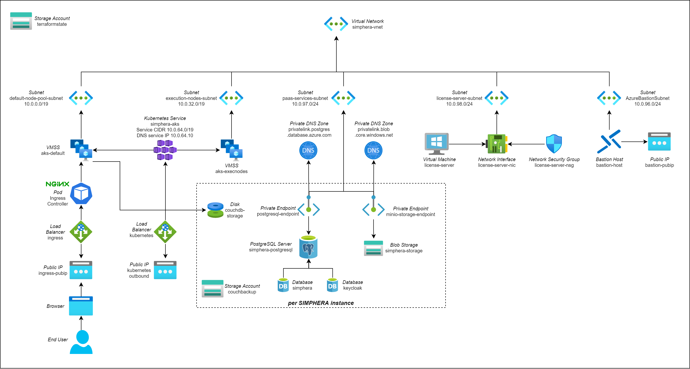

# SIMPHERA Reference Architecture for Azure

This repository contains the reference architecture of the infrastructure needed to deploy dSPACE SIMPHERA to the Azure Public Cloud. It does not contain the helm chart needed to deploy SIMPHERA itself, but only the base infrastructure such as Kubernetes, PostgreSQL, storage accounts, etc.

You can use the reference architecture as a starting point for your SIMPHERA installation if you plan to deploy SIMPHERA to Azure. You can use the reference architecture as is and only have to configure few individual values. If you have special requirements feel free to adapt the architecture to your needs. For example, the reference architecture does not contain any kind of VPN connection to a private, on-premise network because this is highly specific. But the reference architecture is configured in such a way that the ingress points are available in the public internet.

Using the reference architecture you can deploy a single or even multiple instances of SIMPHERA, e.g. one for _production_ and one for _testing_.

## Terraform

This reference architecture is provided as a [Terraform](https://terraform.io/) configuration. Terraform is an open-source command line tool to automatically create and manage cloud resources. A Terraform configuration consists of various `.tf` text files. These files contain the specifications of the resources to be created in the cloud infrastructure. That is the reason why this approach is called _infrastructure-as-code_. The main advantage of this approach is _reproducibility_ becaue the configuration can be mainted in a source control system such as Git.

### Variables

Terraform uses _variables_ to make the specification configurable. The concrete values for these variables are specified in `.tfvars` files. So it is the task of the administrator to fill the `.tfvars` files with the correct values. This is explained in more detail in a later chapter.

### State

Terraform has the concept of a _state_. On the one hand side there are the resource specifications in the `.tf` files. On the other hand there are the resources in the cloud infrastructure that are created based on these files. Terraform needs to store _mapping information_ which element of the specification belongs to which resource in the cloud infrastructure. This mapping is called the _state_. In general you could store the state on your local hard drive. But that is not a good idea because in that case nobody else could change some settings and apply these changes. Therefore the state itself should be stored in the cloud.

So you need to manually create a storage account in Azure before you can start using Terraform. This is explained in more detail in the section _Prerequisites_.

## Overview

As mentioned before, the reference architecture is defined as a _Terraform configuration_. It has been tested with Terraform version v1.0.0.

The following figure shows the main resources of the architecture:



## Prerequisites

Before you start you need an Azure subscription and the `contributor` role to create the resources needed for SIMPHERA. Additionally, you need to create the following resources that are not part of this Terraform configuration:

- _Storage Account_: A storage account with Performance set to `standard` and account kind set to `StorageV2 (general purpose v2)` is needed to store the Terraform state. You also have to create a container for the state inside the storage account.
- _Log Analytics Workspace_ (optional): In order to store the log data of the services you have to provide such a workspace inside your subscription.

On your administration PC you need to install the [Terraform](https://terraform.io/) command, the [Azure CLI](https://docs.microsoft.com/en-us/cli/azure/) and `ssh-keygen` which is typically available on most operating systems.

## Authentication

To login to Azure, use:

```sh
az login
```

To switch to the correct subscription you can use the following command:

```sh
az account set --subscription "My Subscription"
```

## Clone Repository

If you did not already clone this Git repository please clone it now to your local administration PC.

## SSH Keys

In order to be able to connect to the Kubernetes nodes using _ssh_ you need to create private _ssh keys_. You have to create such keys by executing the following command in the _root_ folder:

```sh
# bash
ssh-keygen -t rsa -b 2048 -f shared-ssh-key/ssh -q -N ""

# Powershell
ssh-keygen -t rsa -b 2048 -f shared-ssh-key/ssh -q -N """"
```

## State

As mentioned before Terraform stores the state of the resources it creates within a container of an Azure storage account. Therefore, you need to specify this location.

To do so, please make a copy of the file `state-backend-template`, name it `state-backend.tf` and open the file in a text editor. The values have to point to an existing storage account to be used to store the Terraform state:

* `resource_group_name`: The name of the resource group your storage account is located in.
* `storage_account_name`: The name of the storage account.
* `container_name`: The name of the container inside the storage account to be used to store the terraform state. You need to create this container manually.
* `key`: The name of the file to be used inside the container to be used for this terraform state.
* `environment`: Use the value `public` for the general Azure cloud.

## Configuration

For your configuration, please make a copy of the file `terraform.tfvars.example`, name it `terraform.tfvars` and open the file in a text editor. This file contains all variables that are configurable including documentation of the variables. Please adapt the values before you deploy the resources.

### Mandatory Variables

Here is the list of the variables that you must change in `terraform.tfvars`:

* `subscriptionId`: The ID of the Azure subscription you want to deploy SIMPHERA to
* `location`: The name of the Azure region you want to deploy SIMPHERA to
* `infrastructurename`: The name of this infrastructure. This name will also be used as a prefix for various Azure resource groups. So please choose it carefully.
* `licenseServerAdminPassword`: The password for the user `cluster` of the Windows VM used as the license server.
* `simpheraInstances`: As mentioned before you can configure multiple instances of SIMPHERA, such as _staging_ and _production_. This variable contains a map of these instances. Per instance you must set the following variables:
  * `name`: The name of the instance. This name will also be used as a prefix for various Azure resource groups.
  * `postgresqlAdminPassword`: The password for the user `dbuser` of the PostgreSQL server.

There are additional, optional variables. These variables are documented inside the `terraform.tfvars` file.

## Deployment

Before you can deploy the resources to Azure you have to initialize Terraform:

```sh
terraform init
```

Afterwards you can deploy the resources:

```sh
terraform apply
```
Terraform automatically loads the variables from your `terraform.tfvars` variable definition file.

## MinIO Storage

For each configured SIMPHERA instance an individual Azure storage account is created to store binary artifacts. The name of the storage account is a concatenation of the _infrastructurename_ and the _instancename_, where hyphens are removed and which is clipped to a maximum of 24 characters. Please open the Azure Portal and navigate to the storage account which is located inside the resource group `<instancename>-storage`. Later during the configuration of the SIMPHERA Helm Chart you need the name of this storage account and also an _Access Key_ that is also accessible from the portal.

## Kubernetes

This deployment contains a managed Kubernetes cluster (AKS). In order to use command line tools such as `kubectl` or `helm` you need a _kubeconfig_ configuration file. This file will automatically be exported by Terraform under the filename `<infrastructurename>.kubeconfig`.

If you want to _ssh_ into a Kubernetes worker node you can use a command like this:

```sh
ssh -i shared-ssh-key/ssh simphera@<name-or-ip-of-node>
```

But please keep in mind that the nodes themselves do not get _public IPs_. Therefore you may need to create a _Linux jumpbox VM_ within your virtual network to be able to connect to a node from there. In that case you have to copy the private key to that machine and have to set the correct file access: `chmod 600 shared-ssh-key/ssh`. As an alternative you can use the _License Server Windows VM_ as jumpbox.

## Delete Resources

To delete all resources you have to execute the following command:

```sh
terraform destroy
```

Please keep in mind that this command will also delete all storage accounts including your backups. So please be careful.

## Next steps

As a next step you have to deploy SIMPHERA to the Kubernetes cluster by using the SIMPHERA Quick Start helm chart. You will find detailed instructions in the README file inside the Helm chart itself.
