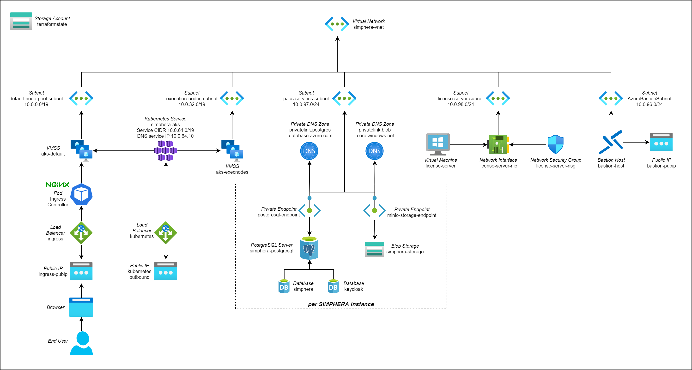

# SIMPHERA Reference Architecture for Azure

This repository contains the reference architecture of the infrastructure needed to deploy dSPACE SIMPHERA to the Azure Public Cloud. It does not contain the helm chart needed to deploy SIMPHERA itself, but only the base infrastructure such as Kubernetes, PostgreSQL, storage accounts, etc.

You can use the reference architecture as a starting point for your SIMPHERA installation if you plan to deploy SIMPHERA to Azure. You can use the reference architecture as is and only have to configure few individual values. If you have special requirements feel free to adapt the architecture to your needs. For example, the reference architecture does not contain any kind of VPN connection to a private, on-premise network because this is highly specific. But the reference architecture is configured in such a way that the ingress points are available in the public internet.

Using the reference architecture you can deploy a single or even multiple instances of SIMPHERA, e.g. one for _production_ and one for _testing_.

## Terraform

This reference architecture is provided as a [Terraform](https://terraform.io/) configuration. Terraform is an open-source command line tool to automatically create and manage cloud resources. A Terraform configuration consists of various `.tf` text files. These files contain the specifications of the resources to be created in the cloud infrastructure. That is the reason why this approach is called _infrastructure-as-code_. The main advantage of this approach is _reproducibility_ becaue the configuration can be mainted in a source control system such as Git.

### Variables

Terraform uses _variables_ to make the specification configurable. The concrete values for these variables are specified in `.tfvars` files. So it is the task of the administrator to fill the `.tfvars` files with the correct values. This is explained in more detail in a later chapter.

### State

Terraform has the concept of a _state_. On the one hand side there are the resource specifications in the `.tf` files. On the other hand there are the resources in the cloud infrastructure that are created based on these files. Terraform needs to store _mapping information_ which element of the specification belongs to which resource in the cloud infrastructure. This mapping is called the _state_. In general you could store the state on your local hard drive. But that is not a good idea because in that case nobody else could change some settings and apply these changes. Therefore the state itself should be stored in the cloud.

So you need to manually create a storage account in Azure before you can start using Terraform. This is explained in more detail in the section _Prerequisites_.

## Overview

As mentioned before, the reference architecture is defined as a _Terraform configuration_. It has been tested with Terraform version v1.0.0.

The following figure shows the main resources of the architecture.
The figure shows using Azure Database for PostgreSQL and Private Link. This configuration is recommended by dSPACE. The general purpose tier for the Postgresql server is required to use the private link. The reference architecture also supports the basic tier. In this case, instead of the private link, firewall rules are used that only allow access from within the Kubernetes cluster.



## Prerequisites

Before you start you need an Azure subscription and the `contributor` role to create the resources needed for SIMPHERA. Additionally, you need to create the following resources that are not part of this Terraform configuration:

- _Storage Account_: A storage account with Performance set to `standard` and account kind set to `StorageV2 (general purpose v2)` is needed to store the Terraform state. You also have to create a container for the state inside the storage account.
- _KeyVault_: The credentials of the PostgreSQL servers and the keys to encrypt the disks of the virtual machine for the license server must be stored in an Azure KeyVault. The KeyVault is not managed by Terraform and has to be created manually (see Azure KeyVault section).
- _Log Analytics Workspace_ (optional): In order to store the log data of the services you have to provide such a workspace inside your subscription.

On your administration PC you need to install the [Terraform](https://terraform.io/) command, the [Azure CLI](https://docs.microsoft.com/en-us/cli/azure/) and `ssh-keygen` which is typically available on most operating systems.

## Authentication

To login to Azure, use:

```sh
az login
```

To switch to the correct subscription you can use the following command:

```sh
az account set --subscription "My Subscription"
```

## Clone Repository

If you did not already clone this Git repository please clone it now to your local administration PC.

## SSH Keys

In order to be able to connect to the Kubernetes nodes using _ssh_ you need to create private _ssh keys_. You have to create such keys by executing the following command in the _root_ folder:

```sh
# bash
ssh-keygen -t rsa -b 2048 -f shared-ssh-key/ssh -q -N ""

# Powershell
ssh-keygen -t rsa -b 2048 -f shared-ssh-key/ssh -q -N """"
```

## How to get secrets and keys

To get a list of all postgresql passwords run the following command:

```powershell
$secretnames = terraform output -json secretnames | ConvertFrom-Json
$keyvaultname = terraform output -json key_vault_name
$postgresql_passwords = @{}
foreach($prop in $secretnames.PsObject.Properties)
{
    $secret = az keyvault secret show --name $prop.value --vault-name $keyvaultname | ConvertFrom-Json
    $value = $secret.value | ConvertFrom-Json
    $postgresql_passwords[$prop.name] = ConvertTo-SecureString $value.postgresql_password -AsPlainText -Force
    Write-Host "The value of $($prop.value) secret for $($prop.name) instance is $value"
    Remove-Variable secret
    Remove-Variable value
}
```

To get list of all storage account keys run the following command:

```powershell
$access_keys = @{}
$storageaccounts = terraform output -json minio_storage_usernames | ConvertFrom-Json
foreach($prop in $storageaccounts.PsObject.Properties)
{
  $keys = az storage account keys list -n $prop.value | ConvertFrom-Json
  $access_keys[$prop.name] = ConvertTo-SecureString $keys[0].value -AsPlainText -Force
  Write-Host "The value of $($prop.value) key for $($prop.name) instance is $(ConvertFrom-SecureString $access_keys[$prop.name] -AsPlainText)"
  Remove-Variable keys
}
```

## Log Analytics Workspace

As mentioned before in order to store the log data of the services you have to provide such a workspace in your subscription.

To create Log analytics workspace, use:

```sh
az monitor log-analytics workspace create --workspace-name "<LogAnalyticsWorkspaceName>" --resource-group "<LogAnalyticsWorkspaceResourceGroup>" --location "<Location>"
```

- LogAnalyticsWorkspaceName - Name of the Log Analytics Workspace
- LogAnalyticsWorkspaceResourceGroup - Name of the Log Analytics Workspace resource group
- Location - Location of the Log Analytics Workspace, eg. westeurope

## State

As mentioned before Terraform stores the state of the resources it creates within a container of an Azure storage account. Therefore, you need to specify this location.

To do so, please make a copy of the file `state-backend-template`, name it `state-backend.tf` and open the file in a text editor. The values have to point to an existing storage account to be used to store the Terraform state:

- `resource_group_name`: The name of the resource group your storage account is located in.
- `storage_account_name`: The name of the storage account.
- `container_name`: The name of the container inside the storage account to be used to store the terraform state. You need to create this container manually.
- `key`: The name of the file to be used inside the container to be used for this terraform state.
- `environment`: Use the value `public` for the general Azure cloud.

## Configuration

For your configuration, please make a copy of the file `terraform.tfvars.example`, name it `terraform.tfvars` and open the file in a text editor. This file contains all variables that are configurable including documentation of the variables. Please adapt the values before you deploy the resources.
List with description of all mandatory and optional variables could be find in the [Inputs](#inputs) part of this readme file.
It is recommended to restrict the access to the Kubernetes API server using authorized IP address ranges by setting the variable `apiServerAuthorizedIpRanges`.
It is recommended to restrict the access to the Key Vault using authorized IP address ranges by setting the variable `keyVaultAuthorizedIpRanges`.

## GPU Usage

If you use AURELION with SIMPHERA then the AURELION Pods are executed in the GPU node pool. AURELION uses a specific OptiX Version and thus needs specific NVIDIA Drivers. NVIDIA provides the [gpu-operator](https://docs.nvidia.com/datacenter/cloud-native/gpu-operator/latest/index.html), a tool with which it is possible to use containerized drivers inside pods. This makes it possible to use the needed driver Versions independent of the default installation of the NVIDIA Drivers on the GPU node pool, which can only be not installed, selecting a version is not possible. [Further infomations](https://learn.microsoft.com/en-us/azure/aks/gpu-cluster#use-nvidia-gpu-operator-with-aks)

### Scale Down Mode

Typically, you have autoscaling enabled for the GPU node pool so that VMs are scaled down if they are no longer needed. However, the AURELION container image is big and it takes time to download the image to the Kubernetes node. Depending on your location this can take more than 30 minutes. To shorten these times the _Scale Down Mode_ of the GPU node pool should be set to _Deallocate_. That means, that a GPU VM is not _deleted_ but only _deallocated_. So you no longer have to pay for the compute resources but only for the disk that will not be deleted when using this mode.

You can enable and disable this mode using the variables `linuxExecutionNodeDeallocate` and `gpuNodeDeallocate`. That means, you can not only configure this for the GPU node pool but also for the Execution node pool. As a default _Deallocate_ is used for both node pools.

## Deployment

Before you can deploy the resources to Azure you have to initialize Terraform:

```sh
terraform init
```

Afterwards you can deploy the resources:

```sh
terraform apply
```

Terraform automatically loads the variables from your `terraform.tfvars` variable definition file.

## MinIO Storage

For each configured SIMPHERA instance an individual Azure storage account is created to store binary artifacts. The name of the storage account is a concatenation of the _infrastructurename_ and the _instancename_, where hyphens are removed and which is clipped to a maximum of 24 characters. Please open the Azure Portal and navigate to the storage account which is located inside the resource group `<instancename>-storage`. Later during the configuration of the SIMPHERA Helm Chart you need the name of this storage account and also an _Access Key_ that is also accessible from the portal.

## Kubernetes

This deployment contains a managed Kubernetes cluster (AKS). In order to use command line tools such as `kubectl` or `helm` you need a _kubeconfig_ configuration file. This file will automatically be exported by Terraform under the filename `<infrastructurename>.kubeconfig`.

If you want to _ssh_ into a Kubernetes worker node you can use a command like this:

```sh
ssh -i shared-ssh-key/ssh simphera@<name-or-ip-of-node>
```

But please keep in mind that the nodes themselves do not get _public IPs_. Therefore you may need to create a _Linux jumpbox VM_ within your virtual network to be able to connect to a node from there. In that case you have to copy the private key to that machine and have to set the correct file access: `chmod 600 shared-ssh-key/ssh`. As an alternative you can use the _License Server Windows VM_ as jumpbox.

## Azure Policy

This reference architecture deploys [Azure Policy](https://learn.microsoft.com/en-us/azure/governance/policy/concepts/policy-for-kubernetes) into the Kubernetes cluster.
With Azure Policy, security policies can be defined and violations monitored.
Azure provides various predefined policies.
By default, no policies are assigned to the Kubernetes cluster using the reference architecture.
Instead, an administrator must assign policies manually which requires appropriate permissions.
The Azure built-in roles _Resource Policy Contributor_ and _Owner_ have these permissions.
Using the predefined policy [_Kubernetes cluster containers should only use allowed images_](https://github.com/Azure/azure-policy/blob/master/built-in-policies/policyDefinitions/Kubernetes/ContainerAllowedImages.json) is recommended by dSPACE.
To do this, use the CLI command below:

```powershell
$clustername = "<cluster name>"
$resourcegroup = "<cluster resource group>"
$cluster = az aks show --name $clustername --resource-group $resourcegroup | ConvertFrom-Json
$name = "K8sAzureContainerAllowedImages@${clustername}"
$description = "Kubernetes cluster containers should only use allowed images"
$scope = $cluster.id
$policy = "febd0533-8e55-448f-b837-bd0e06f16469"
$allowedContainerImagesRegex = "^(docker\.io\/(groundnuty|jboss|eclipse-mosquitto|bitnami)|quay\.io\/oauth2-proxy|registry\.dspace\.cloud|registry\.k8s\.io)\/.+$"
$params_ = @"
{
  "allowedContainerImagesRegex": {
    "value": "$allowedContainerImagesRegex" 
  }
}
"@
$params_ = $params_ -replace '\s',''
$params = $params_ -replace '([\\]*)"', '$1$1\"'
az policy assignment create `
  --scope $scope `
  --description $description `
  --name $name `
  --policy $policy `
  --params $params
```

## Delete Resources

To delete all resources you have to execute the following command:

```sh
terraform destroy
```

Please keep in mind that this command will also delete all storage accounts including your backups. So please be careful.

## Next steps

As a next step you have to deploy SIMPHERA to the Kubernetes cluster by using the SIMPHERA Quick Start helm chart. You will find detailed instructions in the README file inside the Helm chart itself.

<!-- BEGIN_TF_DOCS -->
## Requirements

| Name | Version |
|------|---------|
| <a name="requirement_terraform"></a> [terraform](#requirement\_terraform) | >= 1.0.0 |

## Providers

| Name | Version |
|------|---------|
| <a name="provider_azurerm"></a> [azurerm](#provider\_azurerm) | n/a |
| <a name="provider_local"></a> [local](#provider\_local) | n/a |
| <a name="provider_random"></a> [random](#provider\_random) | n/a |

## Modules

| Name | Source | Version |
|------|--------|---------|
| <a name="module_simphera_instance"></a> [simphera\_instance](#module\_simphera\_instance) | ./modules/simphera_instance | n/a |
| <a name="module_gpu_operator"></a> [gpu\_operator](#module\_gpu\_operator) | ./modules/gpu_operator | n/a |

## Resources

| Name | Type |
|------|------|
| [azurerm_bastion_host.bastion-host](https://registry.terraform.io/providers/hashicorp/azurerm/latest/docs/resources/bastion_host) | resource |
| [azurerm_key_vault.simphera-key-vault](https://registry.terraform.io/providers/hashicorp/azurerm/latest/docs/resources/key_vault) | resource |
| [azurerm_key_vault_key.azure-disk-encryption](https://registry.terraform.io/providers/hashicorp/azurerm/latest/docs/resources/key_vault_key) | resource |
| [azurerm_key_vault_secret.license-server-secret](https://registry.terraform.io/providers/hashicorp/azurerm/latest/docs/resources/key_vault_secret) | resource |
| [azurerm_kubernetes_cluster.aks](https://registry.terraform.io/providers/hashicorp/azurerm/latest/docs/resources/kubernetes_cluster) | resource |
| [azurerm_kubernetes_cluster_node_pool.execution-nodes](https://registry.terraform.io/providers/hashicorp/azurerm/latest/docs/resources/kubernetes_cluster_node_pool) | resource |
| [azurerm_kubernetes_cluster_node_pool.gpu-execution-nodes](https://registry.terraform.io/providers/hashicorp/azurerm/latest/docs/resources/kubernetes_cluster_node_pool) | resource |
| [azurerm_network_interface.license-server-nic](https://registry.terraform.io/providers/hashicorp/azurerm/latest/docs/resources/network_interface) | resource |
| [azurerm_network_interface_security_group_association.ni-license-server-sga](https://registry.terraform.io/providers/hashicorp/azurerm/latest/docs/resources/network_interface_security_group_association) | resource |
| [azurerm_network_security_group.license-server-nsg](https://registry.terraform.io/providers/hashicorp/azurerm/latest/docs/resources/network_security_group) | resource |
| [azurerm_private_dns_zone.keyvault-privatelink-dns-zone](https://registry.terraform.io/providers/hashicorp/azurerm/latest/docs/resources/private_dns_zone) | resource |
| [azurerm_private_dns_zone.minio-privatelink-dns-zone](https://registry.terraform.io/providers/hashicorp/azurerm/latest/docs/resources/private_dns_zone) | resource |
| [azurerm_private_dns_zone.postgresql-privatelink-dns-zone](https://registry.terraform.io/providers/hashicorp/azurerm/latest/docs/resources/private_dns_zone) | resource |
| [azurerm_private_dns_zone_virtual_network_link.keyvault-privatelink-network-link](https://registry.terraform.io/providers/hashicorp/azurerm/latest/docs/resources/private_dns_zone_virtual_network_link) | resource |
| [azurerm_private_dns_zone_virtual_network_link.minio-privatelink-network-link](https://registry.terraform.io/providers/hashicorp/azurerm/latest/docs/resources/private_dns_zone_virtual_network_link) | resource |
| [azurerm_private_dns_zone_virtual_network_link.postgresql-privatelink-network-link](https://registry.terraform.io/providers/hashicorp/azurerm/latest/docs/resources/private_dns_zone_virtual_network_link) | resource |
| [azurerm_private_endpoint.keyvault-private-endpoint](https://registry.terraform.io/providers/hashicorp/azurerm/latest/docs/resources/private_endpoint) | resource |
| [azurerm_public_ip.bastion-pubip](https://registry.terraform.io/providers/hashicorp/azurerm/latest/docs/resources/public_ip) | resource |
| [azurerm_resource_group.aks](https://registry.terraform.io/providers/hashicorp/azurerm/latest/docs/resources/resource_group) | resource |
| [azurerm_resource_group.bastion](https://registry.terraform.io/providers/hashicorp/azurerm/latest/docs/resources/resource_group) | resource |
| [azurerm_resource_group.keyvault](https://registry.terraform.io/providers/hashicorp/azurerm/latest/docs/resources/resource_group) | resource |
| [azurerm_resource_group.license-server](https://registry.terraform.io/providers/hashicorp/azurerm/latest/docs/resources/resource_group) | resource |
| [azurerm_resource_group.network](https://registry.terraform.io/providers/hashicorp/azurerm/latest/docs/resources/resource_group) | resource |
| [azurerm_subnet.bastion-subnet](https://registry.terraform.io/providers/hashicorp/azurerm/latest/docs/resources/subnet) | resource |
| [azurerm_subnet.default-node-pool-subnet](https://registry.terraform.io/providers/hashicorp/azurerm/latest/docs/resources/subnet) | resource |
| [azurerm_subnet.execution-nodes-subnet](https://registry.terraform.io/providers/hashicorp/azurerm/latest/docs/resources/subnet) | resource |
| [azurerm_subnet.gpu-nodes-subnet](https://registry.terraform.io/providers/hashicorp/azurerm/latest/docs/resources/subnet) | resource |
| [azurerm_subnet.license-server-subnet](https://registry.terraform.io/providers/hashicorp/azurerm/latest/docs/resources/subnet) | resource |
| [azurerm_subnet.paas-services-subnet](https://registry.terraform.io/providers/hashicorp/azurerm/latest/docs/resources/subnet) | resource |
| [azurerm_virtual_machine_extension.azureDiskEncryption](https://registry.terraform.io/providers/hashicorp/azurerm/latest/docs/resources/virtual_machine_extension) | resource |
| [azurerm_virtual_machine_extension.gc](https://registry.terraform.io/providers/hashicorp/azurerm/latest/docs/resources/virtual_machine_extension) | resource |
| [azurerm_virtual_machine_extension.iaaSAntimalware](https://registry.terraform.io/providers/hashicorp/azurerm/latest/docs/resources/virtual_machine_extension) | resource |
| [azurerm_virtual_machine_extension.microsoftMonitoringAgent](https://registry.terraform.io/providers/hashicorp/azurerm/latest/docs/resources/virtual_machine_extension) | resource |
| [azurerm_virtual_network.simphera-vnet](https://registry.terraform.io/providers/hashicorp/azurerm/latest/docs/resources/virtual_network) | resource |
| [azurerm_windows_virtual_machine.license-server](https://registry.terraform.io/providers/hashicorp/azurerm/latest/docs/resources/windows_virtual_machine) | resource |
| [local_file.kubeconfig](https://registry.terraform.io/providers/hashicorp/local/latest/docs/resources/file) | resource |
| [random_password.license-server-password](https://registry.terraform.io/providers/hashicorp/random/latest/docs/resources/password) | resource |
| [azurerm_client_config.current](https://registry.terraform.io/providers/hashicorp/azurerm/latest/docs/data-sources/client_config) | data source |
| [azurerm_log_analytics_workspace.log-analytics-workspace](https://registry.terraform.io/providers/hashicorp/azurerm/latest/docs/data-sources/log_analytics_workspace) | data source |
| [azurerm_public_ip.aks_outgoing](https://registry.terraform.io/providers/hashicorp/azurerm/latest/docs/data-sources/public_ip) | data source |

## Inputs

| Name | Description | Type | Default | Required |
|------|-------------|------|---------|:--------:|
| <a name="input_apiServerAuthorizedIpRanges"></a> [apiServerAuthorizedIpRanges](#input\_apiServerAuthorizedIpRanges) | List of authorized IP address ranges that are granted access to the Kubernetes API server, e.g. ["198.51.100.0/24"] | `set(string)` | `null` | no |
| <a name="input_gpuNodeCountMax"></a> [gpuNodeCountMax](#input\_gpuNodeCountMax) | The maximum number of nodes for gpu job execution | `number` | `12` | no |
| <a name="input_gpuNodeCountMin"></a> [gpuNodeCountMin](#input\_gpuNodeCountMin) | The minimum number of nodes for gpu job execution | `number` | `0` | no |
| <a name="input_gpuNodeDeallocate"></a> [gpuNodeDeallocate](#input\_gpuNodeDeallocate) | Configures whether the nodes for the gpu job execution are 'Deallocated (Stopped)' by the cluster auto scaler or 'Deleted'. | `bool` | `true` | no |
| <a name="input_gpuNodePool"></a> [gpuNodePool](#input\_gpuNodePool) | Specifies whether an additional node pool for gpu job execution is added to the kubernetes cluster | `bool` | `false` | no |
| <a name="input_gpuNodeSize"></a> [gpuNodeSize](#input\_gpuNodeSize) | The machine size of the nodes for the gpu job execution | `string` | `"Standard_NC16as_T4_v3"` | no |
| <a name="input_infrastructurename"></a> [infrastructurename](#input\_infrastructurename) | The name of the infrastructure. e.g. simphera-infra | `string` | n/a | yes |
| <a name="input_keyVaultAuthorizedIpRanges"></a> [keyVaultAuthorizedIpRanges](#input\_keyVaultAuthorizedIpRanges) | List of authorized IP address ranges that are granted access to the Key Vault, e.g. ["198.51.100.0/24"] | `set(string)` | `[]` | no |
| <a name="input_keyVaultPurgeProtection"></a> [keyVaultPurgeProtection](#input\_keyVaultPurgeProtection) | Specifies whether the Key vault purge protection is enabled. | `bool` | `true` | no |
| <a name="input_kubernetesVersion"></a> [kubernetesVersion](#input\_kubernetesVersion) | The version of the AKS cluster. | `string` | `"1.24.9"` | no |
| <a name="input_licenseServer"></a> [licenseServer](#input\_licenseServer) | Specifies whether a VM for the dSPACE Installation Manager will be deployed. | `bool` | `false` | no |
| <a name="input_licenseServerIaaSAntimalware"></a> [licenseServerIaaSAntimalware](#input\_licenseServerIaaSAntimalware) | Specifies whether a IaaSAntimalware extension will be installed on license server VM. Depends on licenseServer variable. | `bool` | `true` | no |
| <a name="input_licenseServerMicrosoftGuestConfiguration"></a> [licenseServerMicrosoftGuestConfiguration](#input\_licenseServerMicrosoftGuestConfiguration) | Specifies whether a Microsoft Guest configuration extension will be installed on license server VM. Depends on licenseServer variable. | `bool` | `true` | no |
| <a name="input_licenseServerMicrosoftMonitoringAgent"></a> [licenseServerMicrosoftMonitoringAgent](#input\_licenseServerMicrosoftMonitoringAgent) | Specifies whether a MicrosoftMonitoringAgent extension will be installed on license server VM. Depends on licenseServer, logAnalyticsWorkspaceName and logAnalyticsWorkspaceResourceGroupName variables. | `bool` | `true` | no |
| <a name="input_linuxExecutionNodeCountMax"></a> [linuxExecutionNodeCountMax](#input\_linuxExecutionNodeCountMax) | The maximum number of Linux nodes for the job execution | `number` | `10` | no |
| <a name="input_linuxExecutionNodeCountMin"></a> [linuxExecutionNodeCountMin](#input\_linuxExecutionNodeCountMin) | The minimum number of Linux nodes for the job execution | `number` | `0` | no |
| <a name="input_linuxExecutionNodeDeallocate"></a> [linuxExecutionNodeDeallocate](#input\_linuxExecutionNodeDeallocate) | Configures whether the Linux nodes for the job execution are 'Deallocated (Stopped)' by the cluster auto scaler or 'Deleted'. | `bool` | `true` | no |
| <a name="input_linuxExecutionNodeSize"></a> [linuxExecutionNodeSize](#input\_linuxExecutionNodeSize) | The machine size of the Linux nodes for the job execution | `string` | `"Standard_D16s_v4"` | no |
| <a name="input_linuxNodeCountMax"></a> [linuxNodeCountMax](#input\_linuxNodeCountMax) | The maximum number of Linux nodes for the regular services | `number` | `12` | no |
| <a name="input_linuxNodeCountMin"></a> [linuxNodeCountMin](#input\_linuxNodeCountMin) | The minimum number of Linux nodes for the regular services | `number` | `1` | no |
| <a name="input_linuxNodeSize"></a> [linuxNodeSize](#input\_linuxNodeSize) | The machine size of the Linux nodes for the regular services | `string` | `"Standard_D4s_v4"` | no |
| <a name="input_location"></a> [location](#input\_location) | The Azure location to be used. | `string` | n/a | yes |
| <a name="input_logAnalyticsWorkspaceName"></a> [logAnalyticsWorkspaceName](#input\_logAnalyticsWorkspaceName) | The name of the Log Analytics Workspace to be used. Use empty string to disable usage of Log Analytics. | `string` | `""` | no |
| <a name="input_logAnalyticsWorkspaceResourceGroupName"></a> [logAnalyticsWorkspaceResourceGroupName](#input\_logAnalyticsWorkspaceResourceGroupName) | The name of the resource group of the Log Analytics Workspace to be used. | `string` | `""` | no |
| <a name="input_simpheraInstances"></a> [simpheraInstances](#input\_simpheraInstances) | A list containing the individual SIMPHERA instances, such as 'staging' and 'production'. | <pre>map(object({<br>    name                        = string<br>    minioAccountReplicationType = string<br>    postgresqlVersion           = string<br>    postgresqlSkuName           = string<br>    postgresqlStorage           = number<br>  }))</pre> | n/a | yes |
| <a name="input_ssh_public_key_path"></a> [ssh\_public\_key\_path](#input\_ssh\_public\_key\_path) | Path to the public SSH key to be used for the kubernetes nodes. | `string` | `"shared-ssh-key/ssh.pub"` | no |
| <a name="input_tags"></a> [tags](#input\_tags) | The tags to be added to all resources. | `map(any)` | `{}` | no |

## Outputs

| Name | Description |
|------|-------------|
| <a name="output_key_vault_id"></a> [key\_vault\_id](#output\_key\_vault\_id) | n/a |
| <a name="output_key_vault_name"></a> [key\_vault\_name](#output\_key\_vault\_name) | n/a |
| <a name="output_key_vault_uri"></a> [key\_vault\_uri](#output\_key\_vault\_uri) | n/a |
| <a name="output_kube_config"></a> [kube\_config](#output\_kube\_config) | n/a |
| <a name="output_minio_storage_usernames"></a> [minio\_storage\_usernames](#output\_minio\_storage\_usernames) | n/a |
| <a name="output_postgresql_server_hostnames"></a> [postgresql\_server\_hostnames](#output\_postgresql\_server\_hostnames) | n/a |
| <a name="output_postgresql_server_usernames"></a> [postgresql\_server\_usernames](#output\_postgresql\_server\_usernames) | n/a |
| <a name="output_secretnames"></a> [secretnames](#output\_secretnames) | n/a |
<!-- END_TF_DOCS -->